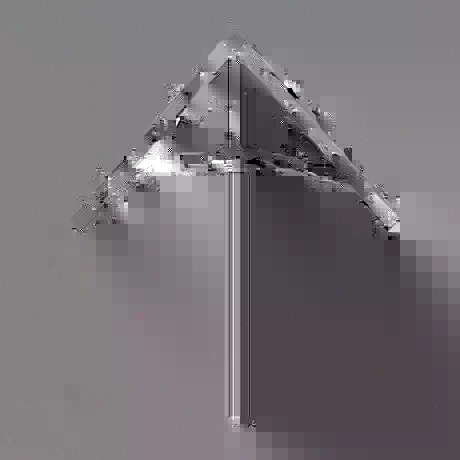
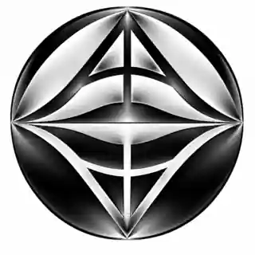
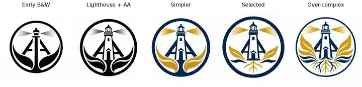

::: {.bs-editorial-lead}
The logo I use now did not begin in Illustrator, a logo generator, or a polished design program. The first version began with pen and paper. That matters, because the useful part of this story is not the finished crest. It is the sequence of decisions, experiments, mistakes, and simplifications that got me there.
:::

## Start with a mark, not a masterpiece

My original personal mark was a very simple combination of my initials, **AA**. It was thin, angular, and almost entirely made from straight lines.

{fig-alt="A thin black personal monogram made from angular lines that combine two letter A forms."}

There was not a huge symbolic system behind it. It was just a compact mark that I could draw by hand and recognize as mine.

That is a useful place to start. A personal logo does not need to explain your entire life. It needs a clear idea.

## Change one thing at a time

Years later, I came back to the mark and changed its geometry.

I made the lines thicker and introduced more curve.

{fig-alt="A bold black AA monogram with a curved cross member and heavier strokes."}

Part of that change is simply where my taste has moved as I have gotten older. The first mark is sharp and narrow. The newer one feels heavier, calmer, and more supported.

The curve also started connecting to other things I care about. It can read like an arch in a bridge, a structural member in a truss, the canopy of an umbrella, the leading edge of a kite from kiteboarding, part of a circle, or even an arrow pointing upward.

Not every viewer has to see every one of those things. In fact, they probably will not. A symbol can carry several associations without turning all of them into literal pictures.

That became one of the main design lessons for me: **suggestion is often stronger than explanation**.

## When an experiment becomes art instead of a logo

Once I started exploring the shape digitally, I pushed it much further.

{fig-alt="A glossy black and white circular abstract composition built from mirrored versions of the AA shape."}

I like this image, but I do not really think of it as a logo.

It is closer to abstract art. The gradients, reflections, mirrored geometry, and depth make it interesting as an image, but they also make it harder to reproduce consistently. It depends on shading. It becomes fragile at small sizes. It would be awkward to cut from vinyl, engrave with a laser, emboss, print in one colour, or use as a tiny favicon.

That is an important distinction for students making their own marks. Something can be visually interesting and still fail as a logo.

A good test is to remove the effects. If the design only works because of glow, gradients, shadows, or texture, the underlying mark may not be strong enough yet.

## Turning the mark into a crest

The next idea was different.

I wanted to keep a simple personal logo, but I also wanted a fuller **crest** that could say more about me. The AA mark could remain the compact symbol. The crest could hold more of the story.

That led to a circle and a lighthouse.

The lighthouse connects to Port Credit. It also naturally carries ideas of place, direction, light, guidance, and looking outward. The original AA geometry is still there, but it becomes part of the structure around the lighthouse instead of sitting by itself.

From there I started introducing other forms. Roots could represent where something comes from and what keeps it grounded. Leaves could represent growth. Water connects to the lake and to movement. The circular boundary makes the whole thing read more like a crest or seal instead of a loose illustration.

The challenge was no longer finding ideas.

The challenge was deciding how many ideas the crest could survive.

## Simplify, add colour, then simplify again

The crest did not arrive all at once. I went through black-and-white versions first, then colour, then versions with more and more symbolic detail.

{fig-alt="Five crest iterations labelled Early B&W, Lighthouse plus AA, Simpler, Selected, and Over-complex."}

The early black-and-white versions helped me figure out whether the lighthouse and AA structure were recognizable without relying on colour. Once that worked, blue and gold gave the design a clearer identity.

The simpler colour version is very clean, but it loses some of the character I wanted. The version labelled **Selected** is the one I ultimately preferred. It keeps the lighthouse, AA structure, light, water, growing forms, and roots, while still reading quickly as a crest.

Then I kept going.

The final experiment in the sequence contains more of almost everything: more leaves, more waves, more roots, more line changes, and more things competing for attention. At a large size it can work as an illustration. At a small size, the hierarchy starts to collapse.

That over-complex version was useful because it showed me where to stop. The design process stopped being about adding meaning and became about editing.

The version in the middle had enough detail to feel like a crest, but it was still simple enough to function as one.

## What I want students to notice

For the first logo assignment, I do not want everyone to make a lighthouse, a circle, or anything that looks like mine. The useful part to copy is the **process**:

1. Start on paper and make a mark you can draw yourself.
2. Choose a small number of ideas that actually matter to you.
3. Make several versions instead of trying to perfect the first one.
4. Change one or two things at a time so you can see what each decision does.
5. Test the design in black and white, at small size, and as something that could actually be made.
6. Keep the experiments, including the bad ones, because they show how the final design developed.
7. Stop adding when the design begins explaining itself instead of symbolizing.

A logo is not a biography. A crest can carry more, but it still needs hierarchy.

The strongest version is often not the one with the most meaning packed into it. It is the one where the important ideas survive simplification.

## The rejected versions are part of the work

I am keeping the other versions because they matter.

The abstract black-and-white experiment helped me see the difference between art and identity design. The early lighthouse versions helped me decide what needed to be recognizable. The over-complex crest showed me where detail stopped helping.

Eventually I will add a ZIP containing the wider set of logo experiments that led to the crest, including the versions that did not make the final cut.

That archive is not just extra material. It is evidence of iteration.

The first sketch and the final crest matter, but the space between them is where most of the design happened.
